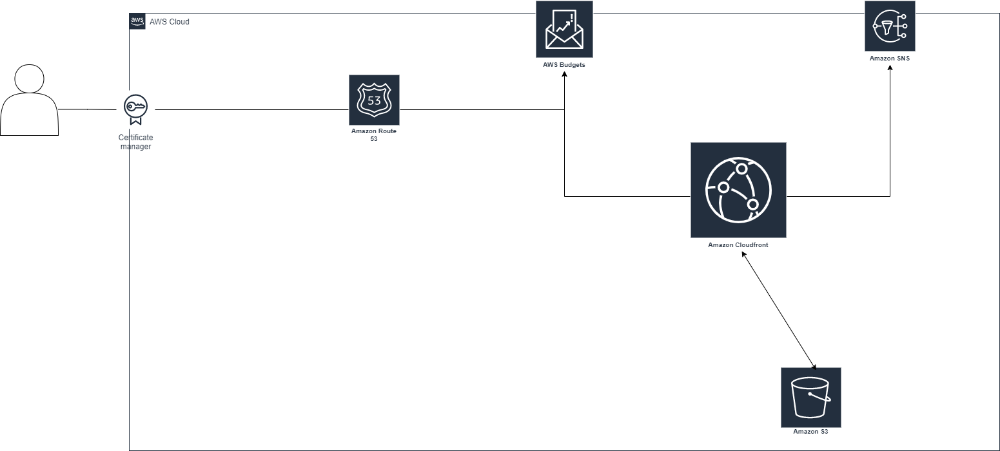

[](CHANGELOG.md) [](NOTICE) [](LICENSE) [](https://elitelabtools.com/)

This repository is for production promo dedicated to **elitesolutionsIT cloud computing BootCamp**.

# Architecture Overview!
 
 [elitelabtools.com](https://elitelabtools.com/)

# PREQUISTES:
 - Install AWS CLI
 - Install terraform on windows

# AWS install
 - make sure to use aws configure to add your creds.
 ```
 aws configure
 ```
 

# Table of Contents
* [App](#App)
* [Pipeline](#Pipeline)
* [Infrastructure](#Infrastructure)

# App
 A simple Word press frame work application that was developed for the sole purpose of promoting this bootcamp.
 - Future Improvement would be to move this to a more production stable environment.
 - Current development testing are done on it to solidify things.
 - It's open for community development.


 # Pipeline
 GitHub Actions work was used for the CICD process.
 # Features
 - Use's AWS Creds set on the Repo level to Authenticate AWS.
 - Copies App folder structure from local Dir to AWS S3 Bucket.
 - App is currently been delivered through CloudFront and spread across Edge locations.

 # Example Code like the Pipeline used to Run this App
 A [Github Action](https://github.com/features/actions) for this kind of AWS pipeline Job.
 ```
 name: Upload website

on:
  push:
    branches:
      - main

jobs:
  deploy:
    runs-on: ubuntu-latest
    steps:
    - name: Checkout
      uses: actions/checkout@v1

    - name: Configure AWS Credentials
      uses: aws-actions/configure-aws-credentials@v1
      with:
        aws-access-key-id: ${{ secrets.AWS_ACCESS_KEY_ID }}
        aws-secret-access-key: ${{ secrets.AWS_SECRET_ACCESS_KEY }}
        aws-region: us-east-1
```
## Inputs

| Name              | Description | Type    | Default | Required |
|-------------------|-------------|---------|---------|:--------:|
| aws-access-key-id | access key | `string` | `""`     | yes |

 # Infrastructure
 Infrastructure is currently been managed with terraform (IAC).
 - The backend state is been managed in an AWS S3 bucket.

 A Module is used to managed the entire infrastructure
 Example:
 
 ```hcl
module "aws_static_website" {
  source = "./modules/app/"
  
  force_destroy       = false
  private_zone        = false
  enable_health_check = true
  limit_amount        = 20
  limit_unit          = "USD"
  budget              = "COST"
  time_unit           = "MONTHLY"
  acl               = "public-read"
  time_period_end   = "2087-06-15_00:00"
  time_period_start = "2022-03-09_00:00"
  bucket_name       = "elitestaticweb"
  website-domain    = "elitelabtools.com"
  }
```
# Sample of backend state

```hcl
terraform {
  backend "s3" {
    bucket  = "< bucket_name>"
    key     = "< bucket key name >"
    region  = "us-east-1"   # Any region in aws allocated for your project.
    profile = "default"     # Can be a custom profile.
  }
}
```

## Providers

| Name | Version |
|------|---------|
| aws | ~> 3.0 |

## Inputs

| Name | Description | Type | Default | Required |
|------|-------------|------|---------|:--------:|
| bucket\_name | custom bucket | `string` | `""` | yes |
